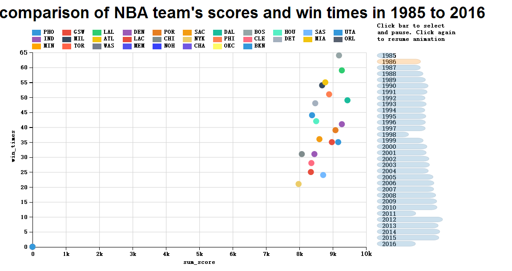

## 概要   
本图数据来源于kaggle NBA数据集，主要描述了从1985年到2016年NBA球队常规赛每年的总得分与总胜场情况，探寻总得分与总胜场的关系。通过bubbleplot来使读者交互式地探寻每年的NBA球队孰强孰弱，以及近三十年来的王者球队都是哪些球队。  
ps:因为部分球队存在改名的现象，所以所收集的数据有一部分缺失，例如BKN在2012年以前它是数据均为0，在2012年以后才有数据。
    
## 设计  
本图采用dimple中Storyboard Control模板，自动展示每年的NBA球队总得分与总胜场情况。其中x轴是球队该年总得分，y轴是球队该年总胜场数。读者可通过点击右边的时间可以暂停动画并查询感兴趣的年份，同时点击图上的圆圈可以显示球队、得分、胜场情况，可助读者追踪感兴趣的年份。  
  
## 反馈
1.不明白横纵坐标轴什么意思。  
解决方案：在设计中加入说明。  
2.图例颜色过于浅，看着不舒服。  
解决方案：分别为为各个球队选择合适的颜色，目前看起来效果还可以。  
3.有一些点始终在原点，而且很多动画的切换是从原点转移出来的。  
解决方案：通过修改，大部分动画切换已经不是从原点冒出来了。但是始终在原点的东西无法解决，因为数据缺失问题，还有就是可以给我们传达这些在原点的球队名字是改过的这一信息。  
  
## 参考资料
http://dimplejs.org/advanced_examples_viewer.html?id=advanced_storyboard_control

## 参考图片

```
picture.jpg
```
